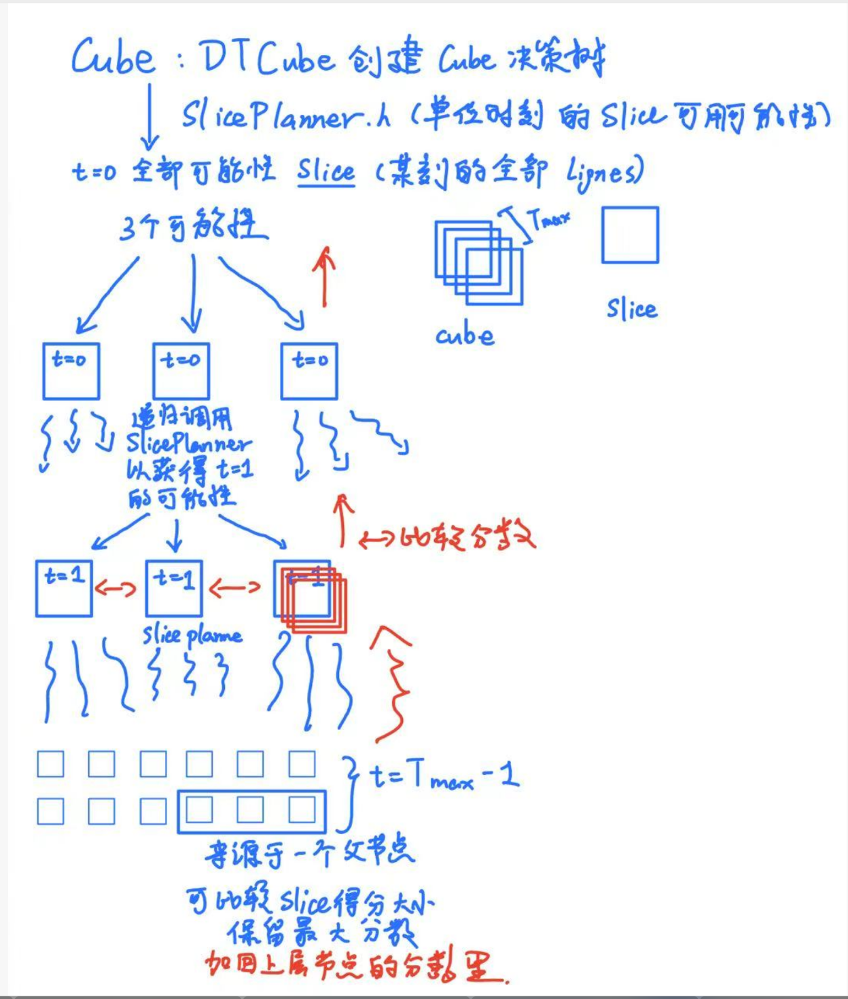

# 实现方法：

## 架构：

### 文件架构

本项目采用模块化的 C++ 架构设计，主要包含以下模块：

```
huawei_projet/
├── include/          # 头文件目录
│   ├── Network.h     # 网络拓扑管理
│   ├── UAV.h         # UAV节点定义
│   ├── Flow.h        # 数据流定义
│   ├── Ligne.h       # 单时刻传输路径
│   ├── Slice.h       # 时刻切片管理
│   ├── Cube.h        # 全时段调度结果
│   ├── LigneFinder.h # A*路径搜索算法
│   ├── SlicePlanner.h# 单时刻调度规划
│   ├── DTCube.h      # 决策树构建器
│   ├── Scheduler.h   # 主调度器
│   └── Utils.h       # 工具函数
├── src/              # 源文件目录
│   ├── main.cpp      # 程序入口
│   ├── Network.cpp   # 网络拓扑实现
│   ├── UAV.cpp       # UAV节点实现
│   ├── Flow.cpp      # 数据流实现
│   ├── Ligne.cpp     # 传输路径实现
│   ├── Slice.cpp     # 时刻切片实现
│   ├── Cube.cpp      # 调度结果实现
│   ├── LigneFinder.cpp # A*搜索实现
│   ├── SlicePlanner.cpp # 单时刻规划实现
│   ├── DTCube.cpp    # 决策树构建实现
│   ├── Scheduler.cpp # 主调度器实现
│   └── Utils.cpp     # 工具函数实现
├── input/            # 测试输入文件
├── output/           # 调度结果输出
├── scripts/          # 构建脚本
├── CMakeLists.txt    # CMake构建配置
└── README.md         # 项目说明
```

### 抽象架构

系统采用分层架构设计，从底层到顶层包括：

#### 1. 数据模型层 (Data Model Layer)

- **Network** → [头文件](https://github.com/LiXiaoquanSU/huawei_projet/blob/main/include/Network.h) | [实现](https://github.com/LiXiaoquanSU/huawei_projet/blob/main/src/Network.cpp): 管理整个UAV网络拓扑，包含所有UAV节点和数据流信息
- **UAV** → [头文件](https://github.com/LiXiaoquanSU/huawei_projet/blob/main/include/UAV.h) | [实现](https://github.com/LiXiaoquanSU/huawei_projet/blob/main/src/UAV.cpp): 表示单个UAV节点，包含坐标、带宽、相位等属性
- **Flow** → [头文件](https://github.com/LiXiaoquanSU/huawei_projet/blob/main/include/Flow.h) | [实现](https://github.com/LiXiaoquanSU/huawei_projet/blob/main/src/Flow.cpp): 表示数据流，包含起点、终点区域、开始时间、数据量等属性

#### 2. 路径规划层 (Path Planning Layer)

- **LigneFinder** → [头文件](https://github.com/LiXiaoquanSU/huawei_projet/blob/main/include/LigneFinder.h) | [实现](https://github.com/LiXiaoquanSU/huawei_projet/blob/main/src/LigneFinder.cpp): 基于A*算法的路径搜索器
  - 支持4邻接和8邻接搜索模式
  - 考虑UAV带宽作为路径代价
  - 针对落地区域进行启发式搜索
- **Ligne** → [头文件](https://github.com/LiXiaoquanSU/huawei_projet/blob/main/include/Ligne.h) | [实现](https://github.com/LiXiaoquanSU/huawei_projet/blob/main/src/Ligne.cpp): 单时刻的传输路径表示
  - 包含路径上的UAV节点序列
  - 计算路径性能指标（带宽、距离、得分等）

#### 3. 时刻调度层 (Slice Scheduling Layer)

- **SlicePlanner** → [头文件](https://github.com/LiXiaoquanSU/huawei_projet/blob/main/include/SlicePlanner.h) | [实现](https://github.com/LiXiaoquanSU/huawei_projet/blob/main/src/SlicePlanner.cpp): 单时刻调度规划器
  - 接受网络状态和时刻参数：`SlicePlanner(network, t)`
  - 内部处理带宽约束和路径冲突检测
  - 通过`planSlices()`生成当前时刻的所有可行Slice候选
  - 返回优化后的Slice集合供DTCubeBuilder选择
- **Slice** → [头文件](https://github.com/LiXiaoquanSU/huawei_projet/blob/main/include/Slice.h) | [实现](https://github.com/LiXiaoquanSU/huawei_projet/blob/main/src/Slice.cpp): 单时刻的调度结果
  - 包含该时刻所有传输路径
  - 计算时刻总得分

#### 4. 全局优化层 (Global Optimization Layer)

- **DTCubeBuilder** → [头文件](https://github.com/LiXiaoquanSU/huawei_projet/blob/main/include/DTCube.h) | [实现](https://github.com/LiXiaoquanSU/huawei_projet/blob/main/src/DTCube.cpp): 决策树构建器
  - 使用深度优先搜索遍历所有可能的时刻组合
  - 累积式得分计算，避免重复评估
  - 空时刻处理，保持时间轴连续性
  - 实现全局最优解搜索
- **Cube** → [头文件](https://github.com/LiXiaoquanSU/huawei_projet/blob/main/include/Cube.h) | [实现](https://github.com/LiXiaoquanSU/huawei_projet/blob/main/src/Cube.cpp): 全时段调度结果
  - 包含所有时刻的最优切片组合
  - 计算全局总得分

#### 5. 控制层 (Control Layer)

- **Scheduler** → [头文件](https://github.com/LiXiaoquanSU/huawei_projet/blob/main/include/Scheduler.h) | [实现](https://github.com/LiXiaoquanSU/huawei_projet/blob/main/src/Scheduler.cpp): 主调度器
  - 协调各层模块的调用
  - 控制整个调度流程
- **Utils** → [头文件](https://github.com/LiXiaoquanSU/huawei_projet/blob/main/include/Utils.h) | [实现](https://github.com/LiXiaoquanSU/huawei_projet/blob/main/src/Utils.cpp): 工具模块
  - 文件I/O处理
  - 路径管理等辅助功能


## 算法流程：

### 1. 初始化阶段

系统启动时首先完成网络拓扑和数据流信息的加载工作。网络拓扑包括所有UAV节点的坐标、带宽参数和相位信息；数据流信息包含流的起点、终点区域、开始时间和数据量等关键参数。随后创建主调度器实例，准备开始调度流程。

### 2. 决策树构建策略

DTCubeBuilder采用深度优先搜索（DFS）方法构建完整的决策树。从时刻t=0开始，递归地为每个时刻生成候选切片（Slice），并探索所有可能的时刻组合路径。核心实现通过`buildDecisionTree()`方法，采用累积式得分计算和路径回溯机制，确保找到全局最优解。



#### 2.1 Cube与Slice层次结构

决策树的核心架构如下：

```
Cube (全时段调度结果)
  ↓ DTCube创建决策树
SlicePlanner (单时刻调度规划)
  ↓ 生成可行Slice
t=0 全新可能性 Slice (包含的全新 Lignes)
  ↓ 3个分支性
┌─────┬─────┬─────┐
│t=0       │t=0       │t=0       │ 
└─────┴─────┴─────┘
  ↓     ↓     ↓
递归调用SlicePlanner
从第t=1的可能性
  ↓
┌─────┬─────┬─────┐
│t=1       │t=1       │t=1       │ ←→ (相互关联)
└─────┴─────┴─────┘
  ↓ Slice规划
每个时刻生成多个Slice候选
保存最大分数
如回到原节点的分数
```

#### 2.2 决策树遍历机制

**递归深度遍历：** 从t=0开始，为每个时刻生成所有可行的Slice候选方案，形成多叉树结构。

```cpp
void DTCubeBuilder::buildDecisionTree(int t,
                                      std::vector<Slice>& currentPath,
                                      double currentScore,
                                      double& bestScore,
                                      std::vector<Slice>& bestPath)
```

**分支探索：** 每个时刻节点可能产生多个分支，代表不同的Slice选择策略，算法系统性地探索每条分支路径。

**累积式得分计算：** 不在终点重新计算，而是在递归过程中累积`currentScore`，提高计算效率。

**空时刻优雅处理：** 当某时刻无可行Slice时，创建`makeEmptySlice()`保持时间轴连续性。

**路径回溯机制：** 
```cpp
currentPath.push_back(slice);
buildDecisionTree(t + 1, currentPath, currentScore + slice.totalScore, bestScore, bestPath);
currentPath.pop_back();  // 自动回溯
```

**终止条件：** 当`t >= T`时，比较`currentScore`与`bestScore`，更新全局最优解。

该策略的核心思想是遍历整个解空间，通过简洁的递归回溯确保找到全局最优解。

#### 2.3 DTCubeBuilder核心实现

**构建入口方法：**
```cpp
Cube DTCubeBuilder::build() {
    std::vector<Slice> currentPath;  // 当前路径
    std::vector<Slice> bestPath;     // 最优路径
    double bestScore = -std::numeric_limits<double>::infinity();
    
    buildDecisionTree(0, currentPath, 0.0, bestScore, bestPath);
    
    Cube cube(T);
    for (const auto& slice : bestPath) {
        cube.addSlice(slice);
    }
    cube.computeTotalScore();
    return cube;
}
```

**关键设计特点：**

1. **参数传递优化**：通过引用传递`currentPath`、`bestScore`、`bestPath`，避免不必要的拷贝开销

2. **分支处理策略**：
   - 有候选Slice：遍历所有candidates，递归探索每个分支
   - 无候选Slice：创建emptySlice保持时间轴完整性

3. **得分lazy计算**：
   ```cpp
   if (slice.totalScore == 0.0 && !slice.lignes.empty()) {
       slice.computeTotalScore();  // 按需计算
   }
   ```

4. **全局最优更新**：
   ```cpp
   if (currentScore > bestScore || bestPath.empty()) {
       bestScore = currentScore;
       bestPath = currentPath;  // 深拷贝最优路径
   }
   ```

### 3. 单时刻路径规划

#### 3.1 基础A*路径搜索设计

采用A*启发式搜索算法在UAV网格中寻找从数据流起点到落地区域的最优路径。算法维护开放集合（待探索节点）和封闭集合（已探索节点），通过f=g+h的评估函数指导搜索方向，其中g为实际代价，h为启发函数估计值。

搜索过程中考虑UAV带宽作为路径代价因子，带宽越低的节点代价越高，从而自然地引导算法避开拥塞节点。当到达落地区域时，通过回溯构造完整的传输路径。

#### 3.2 Ligne剪枝优化策略

为提高路径搜索效率并优化落点选择稳定性，设计了基于落点变化惩罚的三步剪枝算法：

**输入参数：**
- 当前时刻T和临时带宽矩阵状态
- 流的待传总流量信息
- 上次落点位置记录（-1表示首次落点）
- 历史落点变化次数统计

**第一步：最优解识别与奖惩机制**
通过A*算法基于综合评分找到初始最优路径。根据落点变化情况实施差异化的评分调整策略：
- 首次落点情况：给予10分奖励，鼓励快速建立连接
- 落点保持不变：维持原评分，避免不必要的惩罚
- 落点发生变化：根据当前变化次数计算并扣除相应的惩罚分数

**第二步：状态更新机制**
动态维护落点变化次数的临时计数。当检测到落点确实发生变化时，将变化次数临时加1，为后续路径评估提供准确的状态信息。

**第三步：多路径剪枝筛选**
继续搜索其他可行路径，并对每条路径实施智能剪枝判断：

对于新出现的落点：
- 计算采用该落点后下次变化的预期惩罚代价
- 设定动态分数阈值 = 当前最优分数 - 下次变化惩罚
- 仅保留评分超过阈值的高质量路径

对于已存在的落点：
- 比较新路径与现有路径的传输距离
- 优先选择距离更短或相等的路径
- 通过距离优化降低整体传输延迟

#### 3.3 剪枝算法设计优势

**落点稳定性优化：** 通过渐进式惩罚机制，自然地鼓励算法选择稳定的落点，减少频繁切换带来的性能损失。

**解空间多样性保持：** 保留不同落点的最优路径选项，为后续时刻的调度决策提供更大的灵活性空间。

**计算效率提升：** 通过预判分数阈值，提前过滤明显劣质的路径组合，显著减少无效搜索的计算开销。

**代价预估机制：** 引入下次变化代价的前瞻性评估，使算法具备一定的预见性，避免短视决策。

**多目标协调：** 同时优化路径评分和传输距离两个目标，实现综合性能的平衡提升。
### 4. 评分计算机制

系统采用多维度加权评分模型对每条传输路径进行综合评估。评分体系包含四个核心组件：

**U2G传输效率评分：** 以实际传输数据量与总数据量的比值衡量带宽利用率，权重为0.4，体现了传输效率的重要性。

**传输延迟评分：** 基于延迟因子和最大允许延迟时间计算得出，权重为0.2，确保服务质量的时效性要求。

**传输距离评分：** 采用指数衰减函数评估路径长度的影响，权重为0.3，平衡传输效率与路径开销。

**落点稳定性评分：** 通过落点变化次数的倒数反映连接稳定性，权重为0.1，促进网络拓扑的稳定性。

最终评分通过加权求和计算，并乘以100进行标准化处理，形成0-100分的评分范围。

### 5. 输出结果格式化

调度完成后，系统将全时段的最优调度方案转换为标准输出格式。每条记录包含时刻、终点UAV坐标和传输数据量四个字段，采用固定精度的浮点数表示确保输出的一致性和可读性。

## 关键特性：

1. **模块化设计**: 各模块职责明确，便于维护和扩展
2. **A*路径搜索**: 高效的最优路径搜索算法
3. **决策树优化**: 全局最优解搜索，避免局部最优
4. **动态带宽管理**: 实时更新UAV可用带宽
5. **多目标评分**: 综合考虑传输量、延迟、距离等因素

## 性能优化：

1. **累积式得分计算**: DTCubeBuilder在递归过程中累积得分，避免终点重复计算
2. **轻量级状态管理**: 不维护复杂的带宽矩阵状态，依赖SlicePlanner内部约束处理
3. **空时刻优雅处理**: `makeEmptySlice()`确保时间轴连续性，避免递归中断
4. **路径回溯自动化**: `std::vector`的push/pop操作实现自然的状态回溯
5. **启发式函数**: A*搜索中使用合适的启发函数加速收敛
6. **内存管理**: 合理的数据结构设计减少内存占用
7. **并行化潜力**: 架构支持后续并行化改进

---

## 🔗 完整项目实现

**GitHub仓库**: [https://github.com/LiXiaoquanSU/huawei_projet](https://github.com/LiXiaoquanSU/huawei_projet)

**项目结构**: 
- 📁 [源代码目录](https://github.com/LiXiaoquanSU/huawei_projet/tree/main/src) - 所有算法实现
- 📁 [头文件目录](https://github.com/LiXiaoquanSU/huawei_projet/tree/main/include) - 接口定义
- 📁 [测试用例](https://github.com/LiXiaoquanSU/huawei_projet/tree/main/input) - 输入数据示例
- 📁 [运行结果](https://github.com/LiXiaoquanSU/huawei_projet/tree/main/output) - 调度输出示例
- 📄 [构建说明](https://github.com/LiXiaoquanSU/huawei_projet/blob/main/README.md) - 编译运行指南

