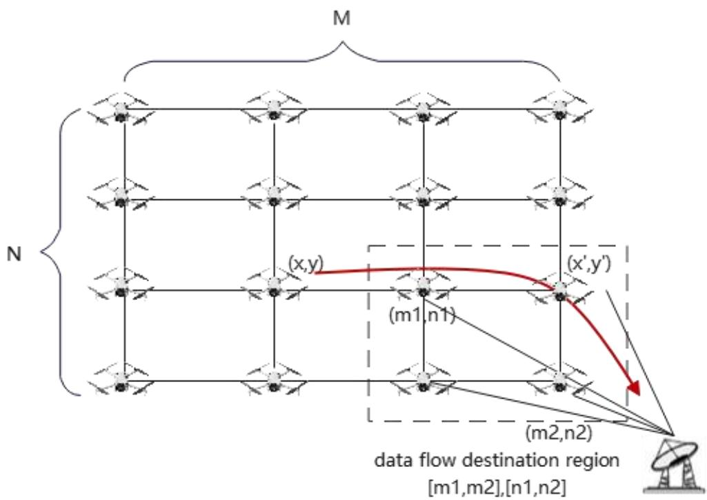
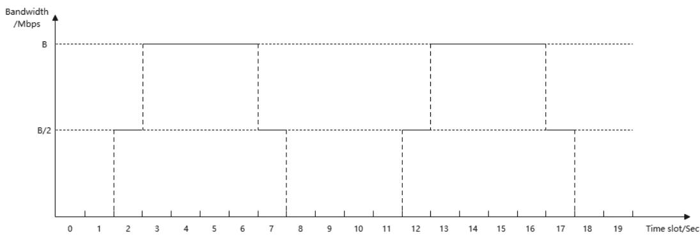

# Time-varying link resource allocation algorithm

# Background

UAV network is an important scenario for 6G connection, and inter-UAV routing networking is the key technology. In a time-varying UAV network, local congestion may cause service interrupt. A traffic allocation and scheduling algorithm is urgently required to relieve network congestion and improve network-wide bandwidth utilization.

UAV-to-ground links (U2GL) are the bottleneck of the bandwidth of the entire network. Therefore, each service data flow of the UAV must be properly distributed to the Ground Station, so as to optimize the bandwidth utilization of the U2GL, the delay of data flow, etc.

# Question modeling

We model the UAV network as an M*N grid, where each UAV node's position is defined by coordinates  $(x, y)$ , with  $x$  ranging from 0 to M-1 and  $y$  from 0 to N-1. The system comprises F flows, each of which connects to a designated UAV and lands within a specified range of UAV areas. The system operates for a total of T seconds, using a discrete simulation granularity of every second.

Based on the UAV network topology and the bandwidth of U2GL, the traffic scheduling scheme for the entire network needs to be designed. Specifically, each data flow needs to be distributed to one U2GL at each time slot.

The U2GL bandwidth model for each UAV is defined as follows:

# [UAV coordinates  $(\mathbf{x},\mathbf{y})$  , peak bandwidth B, phase  $\varphi ]$

Coordinates of the UAV are  $(\mathbf{x},\mathbf{y})$ . The U2GL bandwidth of the UAV  $(\mathbf{x},\mathbf{y})$  is shown by the periodic function  $b(t)$ :

The bandwidth function  $\mathrm{b(t)}$  is a periodic function with a period of 10 seconds. A time slot is 1 second. At time slots 0, 1, 8, 9, the bandwidth is 0 Mbps; at time slots 2 and 7, it is B/2 Mbps; and from 3 to 6 time slots, it is B Mbps. The peak bandwidth B for each UAV might vary. Moreover, each UAV has a different phase  $\varphi$ . Given any time  $t$ , the U2GL bandwidth of UAV (x, y) is  $\mathrm{b}(\varphi + t)$ .

The model of each flow is defined as follows:

{Flow f, Access UAV coordinates (x, y), Flow start time  $t_{start}$ , Total traffic volume s, Range of landing UAVs [m1, n1], [m2, n2]}.

A flow  $f$  accesses the UAV node  $(x, y)$  at the moment  $t_{start}$ , and a total traffic volume of the flow is  $s$  Mbits. Each data flow candidate destination is a region whose UAVs form a rectangle.

Assume that one of the destination UAV coordinate is  $[x', y']$ , then  $m1 \leq x' \leq m2, n1 \leq y' \leq n2$ .

Based on the preceding model definition, the traffic scheduling problem can be defined as providing a network-wide traffic scheduling solution according to the input network topology, U2GL bandwidth, and traffic information and an output format.

# Question Input

Line 1: Four integers, M, N, FN, T. The mesh topology size is represented as M x N (1 < M < 70, 1 < N < 70). FN represents the number of flows (1 ≤ FN < 5000). T is the simulation time (1 < T < 500).

Lines 2 to  $(2 + \mathbf{M}^{*}\mathbf{N} - 1)$ : Each line contains four items:  $\mathbf{x}$ ,  $\mathbf{y}$ ,  $\mathbf{B}$  and  $\boldsymbol{\varphi}$ , where  $\mathbf{B}$  is a double variable and  $\mathbf{x}$ ,  $\mathbf{y}$ ,  $\boldsymbol{\varphi}$  are integer variables. The U2GL bandwidth of UAV  $(\mathbf{x},\mathbf{y})$  is  $b(\boldsymbol{\varphi} + t)$ . And the maximum value of  $b(\boldsymbol{\varphi} + t)$  is  $\mathbf{B}$  ( $0 < \mathbf{B} < 1000$ ,  $0 \leq \boldsymbol{\varphi} < 10$ ).

Lines  $(2 + \mathbf{M}^{*}\mathbf{N})$  to end: Each line contains nine integers,  $\mathbf{f},\mathbf{x},\mathbf{y},\mathbf{t}_{start},Q_{total},\mathbf{m1},\mathbf{n1},\mathbf{m2}$  and n2, representing the flow f, size  $Q_{total}$  ( $1\leq Q_{total} < 3000$ ), access to the UAV network from coordinates  $(\mathbf{x},\mathbf{y})$  at time  $\mathbf{t}_{start}$ , with a landing range of  $[\mathbf{m1},\mathbf{n1}]$ ,  $[\mathbf{m2},\mathbf{n2}]$ .

# Question Output

A scheduling scheme of a flow consists of the following:

Line 1:  $\mathbf{f}$  and  $\mathbf{p}$ , representing the flow  $\mathbf{f}$  has  $\mathbf{p}$  scheduling records.

Lines 2 to  $(2 + \mathbf{p} - 1)$ : Each line contains four numbers,  $\mathbf{t}$ ,  $\mathbf{x}$ ,  $\mathbf{y}$  and  $\mathbf{z}$ , which means the traffic rate of flow  $\mathbf{f}$  on UAV  $(\mathbf{x}, \mathbf{y})$  within the  $\mathbf{t}$ -th second is  $\mathbf{z}$  Mbps. The type of  $\mathbf{z}$  is double, and the other

variables are integers.

Output the scheduling scheme for each flow according to the above rules.

# Scoring Function

For a single flow, the flow score is calculated in weighted average mode with the following components.

1. Total UAV-to-ground (U2G) Traffic Score:  $\frac{\Sigma_i q_i}{Q_{total}}$ .  $q_i$  indicates the traffic size at  $t_i$ .  $t_i$  indicates the time when the traffic is transmitted to the ground.  $\Sigma_i q_i$  indicates the total U2G traffic.  $Q_{total}$  indicates the total traffic volume. (Weight: 0.4)  
2. Traffic Delay Score:  $\Sigma_{i}\frac{T_{max}}{t_{i} + T_{max}} * \frac{q_{i}}{Q_{total}}$ .  $T_{max}$  is 10s by default. (Weight: 0.2)  
3. Transmission Distance Score:  $\Sigma_{i}\frac{q_{i}}{Q_{total}}*2^{-\alpha d_{i}}$ .  $d_{i}$  is the number of hops between the access point and the landing point.  $\alpha$  is a constant and 0.1 by default. (Weight: 0.3)  
4. Landing UAV Point Score:  $\frac{1}{k}$ . k starts at 1, and increases by 1 each time the landing point changes. (Weight: 0.1)

The score of Flow  $j$  is given as follow:

$$
\begin{array}{l} 
\text{score}_j = 100 * (0.4 * \text{TotalU2GTrafficScore} + 0.2 * \text{TrafficDelayScore} + 0.3 \\ 
* \text{TransmissionDistanceScore} + 0.1 * \text{LandingUAVPointScore}) 
\end{array}
$$

Total score: Weighted calculation of flow score for each flow

$$
\sum_{j} \frac {Q_{total_j}}{\Sigma_ {j} Q _ {total_j}} \cdot score_{j}
$$

# Example:

<table><tr><td>standard input</td><td>standard output</td></tr><tr><td>3 3 2 10</td><td>1 4</td></tr><tr><td>0 0 10 3</td><td>0 0 0 10</td></tr><tr><td>1 0 10 3</td><td>1 0 0 10</td></tr><tr><td>2 0 10 3</td><td>2 0 0 10</td></tr><tr><td>0 1 10 3</td><td>3 0 0 10</td></tr><tr><td>1 1 10 3</td><td>2 2</td></tr><tr><td>2 1 10 3</td><td>2 0 1 10</td></tr><tr><td>0 2 10 3</td><td>3 0 2 10</td></tr></table>

12103  
2 2 10 3  
1000400022  
2012200022

# Scoring Calculation

Flow 1:

Total U2G Traffic Score=40 =1.0  
Traffic Delay Score  $\frac{10}{0 + 10} * \frac{10}{40} + \frac{10}{1 + 10} * \frac{10}{40} + \frac{10}{2 + 10} * \frac{10}{40} + \frac{10}{3 + 10} * \frac{10}{40} = 0.877$  
Transmission Distance Score  $= \frac{10}{40} * 2^0 + \frac{10}{40} * 2^0 + \frac{10}{40} * 2^0 + \frac{10}{40} * 2^0 = 1.0$  
U2G Point Score: Flow 1 selects only 1 landing UAV:  $(0,0)$ . Therefore,  $k = 1$ . Landing UAV Point Score  $= \frac{1}{1} = 1.0$  
Total Score  $= 100(0.4\cdot 1.0 + 0.2\cdot 0.877 + 0.3\cdot 1.0 + 0.1\cdot 1.0) = 97.54$

Flow 2:

Total U2G Traffic Score  $= \frac{20}{20} = 1.0$  
Traffic Delay Score  $= \frac{10}{0 + 10} * \frac{10}{20} + \frac{10}{1 + 10} * \frac{10}{20} = 0.9545$  
Transmission Distance Score  $= \frac{10}{20} * 2^0 + \frac{10}{20} * 2^{-0.1} = 0.9665$  
U2G Point Score: Flow 2 landing point changes once. Therefore,  $k = 2$ . Landing UAV Point Score  $= \frac{1}{2} = 0.5$  
Total Score  $= 100(0.4\cdot 1.0 + 0.2\cdot 9545 + 0.3\cdot 0.9665 + 0.1\cdot 0.5) = 93.085$

Total score:  $\frac{40}{40 + 20} * 97.54 + \frac{20}{40 + 20} * 93.085 = 96.055$
